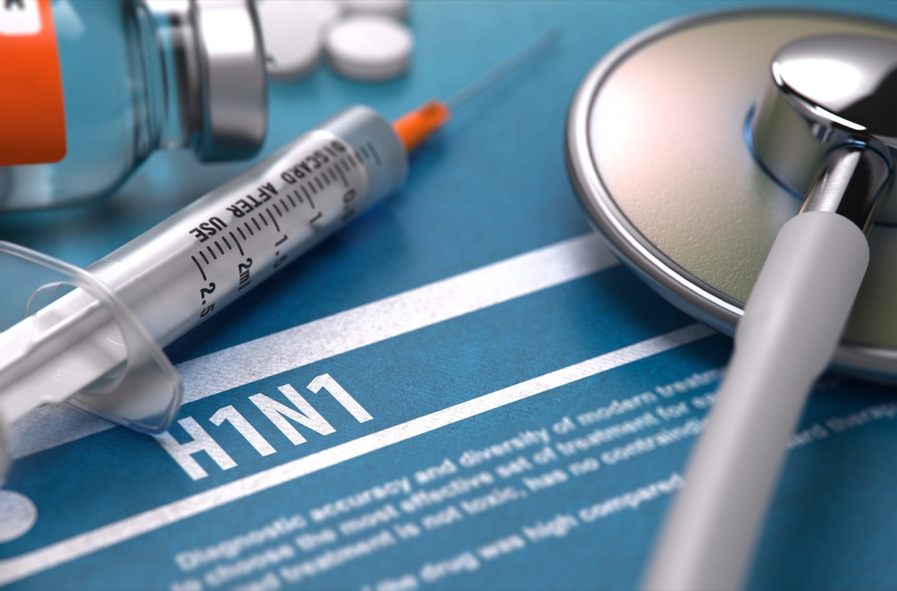
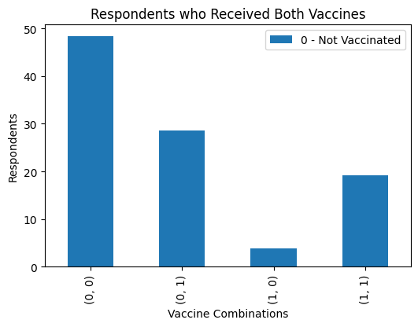
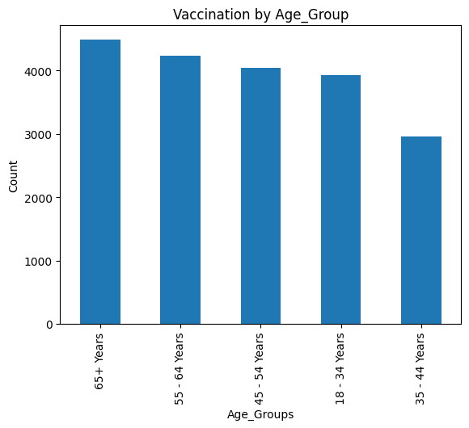
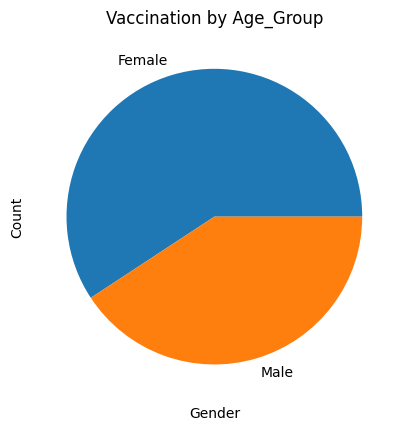
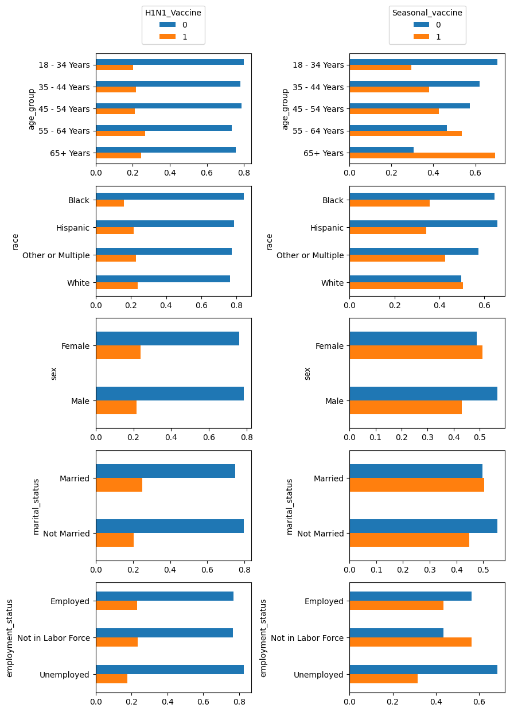
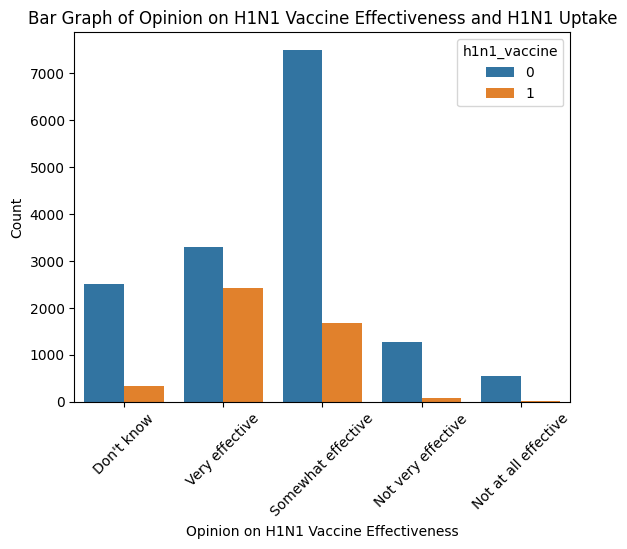
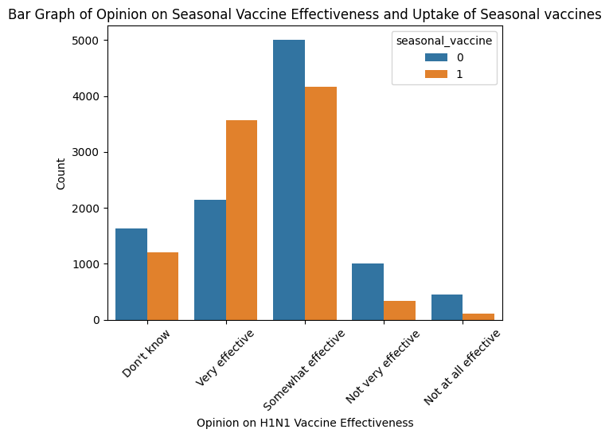
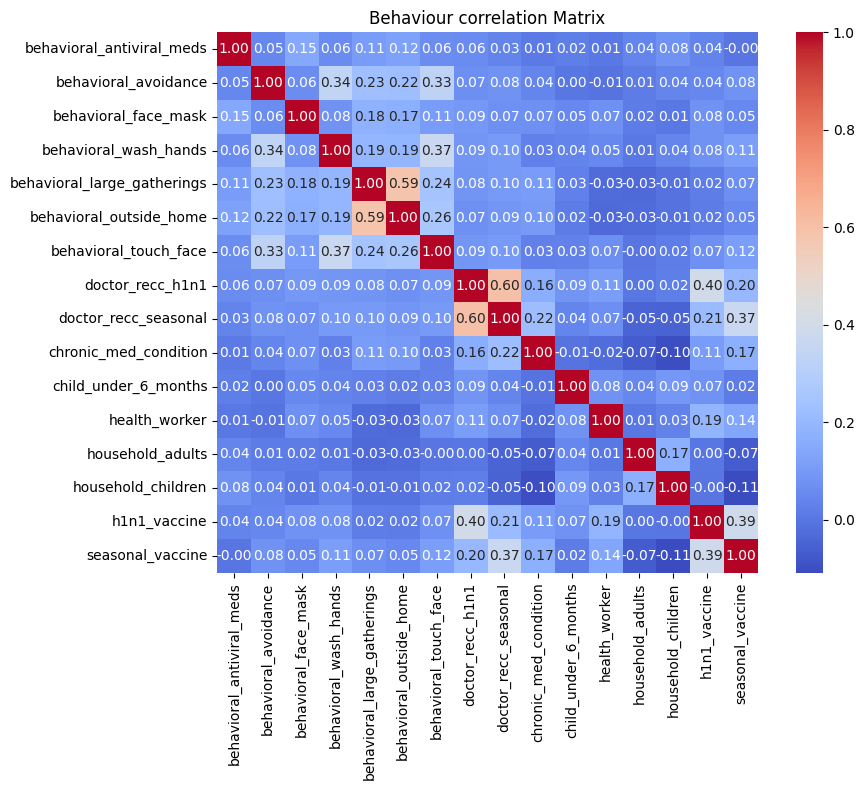

# H1N1_Seasonal_Flu_Phase_3_Project
# Name: Maryan Daud Ahmed 
# Project: Predictive analysis on factors contributing to uptake of HIN1 and Seasonal Flu vaccine 

## Overview 
Vaccination,remains a key public health measure used to fight infectious diseases. Vaccines provide immunization for individuals, and enough immunization in a community can further reduce the spread of diseases through "herd immunity"

Beginning in spring 2009, a pandemic caused by the H1N1 influenza virus, colloquially named "swine flu," swept across the world. Researchers estimate that in the first year, it was responsible for between 151,000 to 575,000 deaths globally.

A vaccine for the H1N1 flu virus became publicly available in October 2009. In late 2009 and early 2010, the United States conducted the National 2009 H1N1 Flu Survey. This phone survey asked respondents whether they had received the H1N1 and seasonal flu vaccines, in conjunction with questions about themselves. These additional questions covered their social, economic, and demographic background, opinions on risks of illness and vaccine effectiveness, and behaviors towards mitigating transmission. 

A better understanding of how these characteristics are associated with personal vaccination patterns can provide guidance for future public health efforts.

This project aims to analyze factors that influence individuals' decision-making processes regarding getting vaccinated against H1N1 and seasonal flu. By gaining insights into these factors,healthcare department can develop targeted strategies and interventions to increase vaccination rates and improve public health outcomes during pandemics 

## Problem Statement 
The world has recently experienced the impact of major flu outbreaks like the COVID-19, Swine Flu (H1N1) and the Avian Flu(H5N1). The effect of any flu outbreak depends on the type of flu and its respective variants, the population demographics like age, and other underlying health conditions of the individual and vaccination status of the population.Seasonal flu places a substantial burden on the health of people each year. CDC estimates that flu has resulted in 9 million – 41 million illnesses, 140,000 – 710,000 hospitalizations and 12,000 – 52,000 deaths annually between 2010 and 2020.Despite the availability and effectiveness of flu vaccines, there are still significant portions of the population who choose not to get vaccinated. 

To address this problem, it is crucial to investigate the reasons behind these decisions and identify the key factors driving individuals' opinions, perceptions, and behaviors related to flu vaccination and develop startegic interventions to target different cohort and improve vaccine uptake

## Objectives 

1) Determine demographic factors (age,gender,occupation) that determine vaccine uptake
2) Determine Knowledge, Opinions and Behavoiurs that influence vaccine uptake
3) Predict factors that influence individuals to receive H1N1 and seasonal flu vaccines
4) Evaluate AUC & ROC performance of predictive models used 

## Data Understanding 

We will use data sets from phone survey where respondents were asked whether they had received the H1N1 and seasonal flu vaccines, in conjunction with questions about themselves. These additional questions covered their social, economic, and demographic background, opinions on risks of illness and vaccine effectiveness, and behaviors towards mitigating transmission.from [Predict H1N1 and Seasonal Flu Vaccines](https://www.drivendata.org/competitions/66/flu-shot-learning/)

## Results 

## Univariate Analysis 
About 21% of respondents received only H1N1, while almost half 46% received only Seasonal Vaccine.On combination about 18% of respondents received both vaccines about with 48% receiving atleast one of either vaccine from the total interviewed as shown below 

Majority of the respondents were and female shown below 
 
 

## Bivariate Analysis 

### Vaccine Uptake by Demographic Observations

Age group 
1) H1N1 Vaccine, had almost equal distribution across the age groups however the age group between 55-64 recorded the highest
2) Seasonal vaccine,uptake increased with increas in age group with the highest uptake recorded in age group 65

Race 

3) White race recorded hghest uptake for both Seasonal vaccine and H1N1 vaccine compared to all other races while blacks recorded lowest uptake for both vaccines 

Sex

4) Almost equal proportion of men and women received H1N1 vaccine, however women recieved slightly more vaccines as compared to men for both strains 

Marital Status  

5) Higher uptake recorded among married couples for both vaccines  

Education

6) College graduates made the majority of those who received both H1N1 Vaccine and Seasonal vaccine

Employment status
7) Workers not in labour force were the highest vaccinated group for both H1N1 and Seasonal vaccines with unemployed recording lowest numbers for both vaccines 

Shown in the image below 

### Vaccine Uptake by Opinions of respondents 

1) H1N1 Vaccine effectiveness: Majority of the vaccinated reported the vaccine to be very effective while majority of unvaccinated decalred it as somewhat effective

2) Seasonal Vaccine effectiveness: Majority of the vaccinated and unvaccinated reported the vaccine to be somewhat effective while few of the vaccinated also reported the vaccine to be not effective at all

### Chisquare Test conducted to how respondents opinions and demographic variable influence vaccine uptake  

 - P values of <0.05 observed for all variables assessed inidcating that all opinions assessed such as (risk of aquiring infection from non vaccination and vaccines being effective against disease) and demographic variables such as (being over 65 years, female,and educated) are determinats of vaccination 

## Multivariate Analysis 

### Correlation between Behavioural Factors and vaccine uptake 

Correlation matrix between vaccine uptake for both h1n1 and seasonal flu

1) High correlation between Doctor_reccomendation for vaccination for both h1n1 (0.40) and seasonal flu vaccine (0.21) and taking the actual vaccines.This highlights the critical role of healthcare professionals in influencing vaccine decisions.

2) Seasonal_vaccine (0.37) and h1n1_vaccine (0.40). Respondents who took the seasonal flu vaccine are also more likely to take the H1N1 vaccine, suggesting general vaccine receptiveness.

3) Doctor_recc_seasonal (0.21): Recommendations for seasonal flu vaccination also correlate positively, though less strongly than for H1N1-specific recommendations.

4) Repondents with chronic illness show increased uptake of vaccine , more so seasonal vaccine (0.17) as compared to (0.11)  H1N1 vaccine

5) There is moderate correlation between being a healthcare workers and taking both seasonal vaccine (0.14) and H1N1 vaccines (0.19)

6) low correlation is observed between having a face mask (0.12), frequently washing hands (0.11) and taking the seasonal flu vaccine uptake.

7) Most behavioral variables such as mask-wearing, hand-washing, or avoiding close contact with others, reduced time at large gatherings, using face mask, and reduced contact with people outsde home show near-zero correlations, indicating minimal direct relationship with H1N1 vaccine  

## Modelling

Created two predictive models:Models used 
1) Logistic regression model
2) Decision tree model 

Both models had Accuracy of 100% in predicting vaccine uptake data  

Cross validation of model conducted: Cross_Validated accuracy scores: 1 and Mean accuracy: 1.0

## Conclusion 

The results of this study ascertain certain vaccine uptake factors such as opinions/knowledge and demographic factors provide an understanding and influence vaccination decision.This factors may provide guidance on better approaches by groups intending to accelaret vaccine uptake in similar settings. 

1) Low vaccine uptake among younger population, people of black race, and unemployed individuals

2) Tertiary education was found to be a strong predictor of vaccination, those with tertiary and secondary level of education being more inclined to get the vaccine

2) Increased uptake of seasonal flu vaccines as compared to H1N1 vaccine 

3) Those who perceived vaccination as a way of preventing disease and were at risk of infection without the vaccine were more likely to be vaccinated 

5) Respondent who had reccomendations from health care workers to get vaccinated understood that vaccination plays a crucial line of defence from infections and took the vaccines

## Reccomendations

From this study, the following suggestions may be made to improve h1n1 and seasonal vaccination uptake in the Counrty,and other places:

1) There is a need to tailor educational intervention programs for specific target groups targeting the low-income groups,African americans and unemployed in vaccination drives/acceleration campaigns.

2) Use of information, Education and communication (IEC) materials such as visual Aids, posters, flyers and media for ease of understanding and to effectively communicate and educate public on role of vaccination Considering that education level affected vaccine uptake.

3) Continuous advocacy and social mobilization with context specific tailored messaging such as effectiveness of vaccines ,perceived risks of opting out of vaccination drives and, clarifying misconceptions,creating awareness on flu symptoms and prevention measures as this were drivers of increased uptake 

4) Creating awareness about diseases of like nature such as seasonal flu and H1N1 should also be targeted alongside promoting inoculation to increase vaccine acceptance.Considering that seasonal flu had more acceptance than H1N1

5) Reccomendation of health workers in reinforcing vaccine uptake has been highlighted,therefore healthcare workers should be prepared and knowledgeable as to participate in a discussion on vaccination together with the patient, in their daily health check-ups and Introduction of vaccination at service delivery points especially for adult targeted vaccines such as flu and h1n1 vaccines, which will in turn lead to reduced missed opportunities for vaccination 

### For more information 

See full analysis on notebook:(H1N1_Seasonal_Flu_Phase_3_Project\notebook.ipynb)